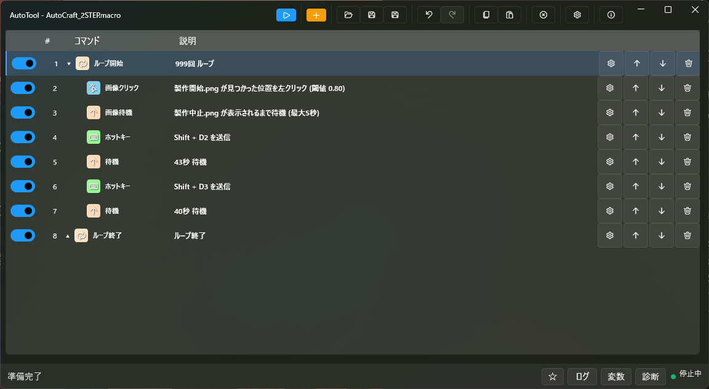

# AutoTool

AutoTool は、Windows 上で定型操作をマクロとして作成・保存・実行するための WPF デスクトップアプリです。  
画面操作（クリック・キー入力）、画像認識、OCR、AI 検出を組み合わせた自動化フローを構築できます。

## スクリーンショット



## 最近の更新（v1.0.11）

- 汎用変数コマンドを追加し、実行中の値入力・取得・加工をマクロ内で扱えるように拡張
- コマンド追加画面と配布版コマンド詳細に、汎用変数コマンドの説明を追加
- 起動、ファイル操作、マクロ実行開始/完了、標準 `ILogger` 出力を `Logs` 配下へ記録するように改善
- ログパネルの表示更新を見直し、マクロ実行中のログが画面上でも追いやすくなるように修正

## ドキュメント導線

- 利用者向け
  - [利用者向けガイド（リポジトリ）](docs/USER_GUIDE.md)
  - [配布版ガイド（ZIP 同梱）](Readme.txt)
  - [配布版コマンド詳細（ZIP 同梱）](Readme_コマンド詳細.txt)
- 開発者向け
  - [開発者向けガイド](docs/DEVELOPER_GUIDE.md)
  - [アーキテクチャ概要](docs/ARCHITECTURE.md)
  - [プラグインアーキテクチャ仕様](docs/PLUGIN_ARCHITECTURE.md)
  - [クラス図（主要関係）](docs/CLASS_DIAGRAM.md)
  - [配布ガイド](docs/DEPLOYMENT.md)
  - [コマンド開発ガイド](docs/COMMAND_DEVELOPMENT_GUIDE.md)

## GitHub 配布（ZIP）

- 正式バージョンの正は GitHub タグ（`vMAJOR.MINOR.PATCH`）です。
- `v*` タグ（例: `v1.2.3`）を push すると、GitHub Actions の `Release Zip` が実行されます。
- 実行後、GitHub Release に `AutoTool-<tag>-win-x64.zip` が添付されます。
- タグ実行時は publish にタグ由来のバージョンを注入し、生成された `AutoTool.exe` の `FileVersion` / `ProductVersion` がタグと一致することを検証します。
- ZIP には `AutoTool.exe`、必要な `*.dll`、`Readme*.txt`、実行構成ファイルが含まれます。

## 最短で動かす

```powershell
dotnet restore .\AutoTool.sln
dotnet build .\AutoTool.sln -c Debug
dotnet run --project .\AutoTool.Bootstrap\AutoTool.Bootstrap.csproj
```

## 起動引数（CLI）

- `AutoTool.exe "<macroPath>"` または `AutoTool.exe -macro "<macroPath>"`: マクロ読込
- `-start`: 読込済みマクロを開始（ファイル同時指定時は読込後に開始）
- `-stop`: 実行中マクロの停止要求
- `-exit`: アプリ終了要求（即時）
- `-exit-on-complete`: マクロ完了後の自動終了（`-start` 必須）
- `-hide`: メインウィンドウを非表示
- `-show`: メインウィンドウを表示して前面化
- `-silent-errors`: CLI実行時の警告/エラーダイアログを抑止（ログは出力）
- `-start` と `-stop` は同時指定不可
- `-exit` と `-exit-on-complete` は同時指定不可
- `-hide` と `-show` は同時指定不可

## ログ

- 実行ログは画面右下の `ログ` パネルで確認できます。
- 調査用のファイルログはアプリ配置先の `Logs\yyyy-MM-dd_HH-mm-ss.log` に出力されます。
- `Settings\appsettings.json` の `Logging:LogLevel` で標準 `ILogger` 出力の記録レベルを調整できます。

## サンプルプラグイン

- PluginSamples\\Sample.Plugin\\plugin.json に配置例を含めています。
- Publish-SamplePlugin.ps1 を実行すると、サンプル DLL と plugin.json を Plugins\\Sample.Plugin へステージングできます。
- 実運用向けのひな形として AutoTool.Plugin.Template と PluginTemplates\\Template.Plugin を含めています。
- 既定の配置先は .\\.deploy\\AutoTool_publish\\Plugins\\Sample.Plugin です。必要に応じて -Destination で AutoTool.Desktop\\bin\\Release\\net10.0-windows\\Plugins\\Sample.Plugin などを指定できます。
- Publish-TemplatePlugin.ps1 を実行すると、テンプレート DLL・plugin.json・README.md を .\\.tmp\\Template.Plugin へ配置できます。
- deploy-to-c-autotool.ps1 は配置先の既存 Plugins を削除せず、publish 側に含まれる Plugins のみを追加・更新します。

## テスト実行

```powershell
dotnet test .\AutoTool.Tests.Application\AutoTool.Tests.Application.csproj -c Debug
dotnet test .\AutoTool.Tests.Domain\AutoTool.Tests.Domain.csproj -c Debug
dotnet test .\AutoTool.Tests.Infrastructure\AutoTool.Tests.Infrastructure.csproj -c Debug
dotnet test .\AutoTool.Tests.Desktop\AutoTool.Tests.Desktop.csproj -c Debug
```

## パフォーマンス計測（コマンド生成）

コマンド生成（`MacroFactory.CreateMacro`）のベンチマークは次で実行できます。

```powershell
dotnet run -c Release --project .\AutoTool.Benchmarks.Automation\AutoTool.Benchmarks.Automation.csproj -- --filter *MacroFactoryBenchmarks*
```

## ソリューション構成（要点）

- `AutoTool.Bootstrap`: アプリ起動エントリ（WPF WinExe）
- `AutoTool.Desktop`: UI / ViewModel / Host 構成
- `AutoTool.Application`: ユースケース層（履歴管理、ファイル操作、AI相談Ports）
- `AutoTool.Domain`: ドメインモデル
- `AutoTool.Automation.Contracts`: コマンド実行契約・入力/サービス抽象
- `AutoTool.Plugin.Abstractions`: プラグイン契約・基本モデル
- `AutoTool.Plugin.Template`: 改名して育てる前提のプラグインひな形
- `AutoTool.Plugin.Host`: プラグイン探索・`plugin.json` 読込・検証・DLL 読込・起動時診断・サービス登録反映・実行委譲・動的プロパティ連携
- `AutoTool.Desktop`: 起動時診断結果のステータス表示とログ表示
- `AutoTool.Automation.Runtime`: コマンド定義・マクロ生成・シリアライズ
- `AutoTool.Infrastructure`: Win32 / OpenCV / OCR / llama.cpp 連携 / 永続化など技術実装
- `AutoTool.Tests.Application`: Application 層の回帰テスト
- `AutoTool.Tests.Domain`: Domain モデルテスト
- `AutoTool.Tests.Infrastructure`: Infrastructure/Runtime の統合・回帰テスト
- `AutoTool.Tests.Desktop`: Desktop/WPF 境界の回帰テスト
- `AutoTool.Benchmarks.Automation`: ベンチマーク

## 対応環境

- Windows
- .NET 10 SDK（C# 14）

詳細は [利用者向けガイド](docs/USER_GUIDE.md) を参照してください。


