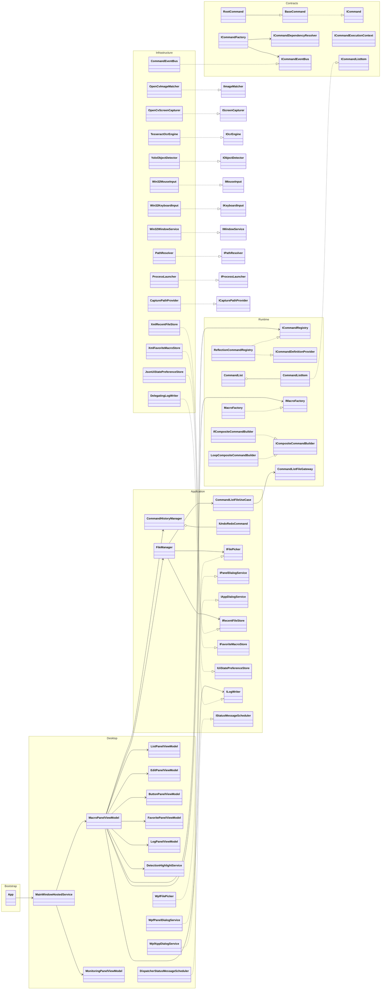

# AutoTool クラス図（主要関係）

この図は代表的なクラス/インターフェース間の関係を示した「抜粋」です。  
詳細実装は各プロジェクト内のソースを参照してください。

```mermaid
classDiagram
direction LR

namespace Bootstrap {
  class App
}

namespace Desktop {
  class MainWindowHostedService
  class MacroPanelViewModel
  class MonitoringPanelViewModel
  class ListPanelViewModel
  class EditPanelViewModel
  class ButtonPanelViewModel
  class FavoritePanelViewModel
  class LogPanelViewModel
  class DetectionHighlightService
  class WpfFilePicker
  class WpfPanelDialogService
  class WpfAppDialogService
  class DispatcherStatusMessageScheduler
}

namespace Application {
  class FileManager
  class CommandListFileUseCase
  class CommandHistoryManager
  class IUndoRedoCommand
  class IFilePicker
  class IPanelDialogService
  class IAppDialogService
  class IRecentFileStore
  class IFavoriteMacroStore
  class IUiStatePreferenceStore
  class ILogWriter
  class IStatusMessageScheduler
}

namespace Runtime {
  class ReflectionCommandRegistry
  class ICommandRegistry
  class ICommandDefinitionProvider
  class CommandList
  class CommandListItem
  class MacroFactory
  class IMacroFactory
  class ICompositeCommandBuilder
  class IfCompositeCommandBuilder
  class LoopCompositeCommandBuilder
  class CommandListFileGateway
}

namespace Contracts {
  class ICommand
  class BaseCommand
  class RootCommand
  class ICommandFactory
  class ICommandDependencyResolver
  class ICommandEventBus
  class ICommandExecutionContext
  class ICommandListItem
}

namespace Infrastructure {
  class CommandEventBus
  class OpenCvImageMatcher
  class OpenCvScreenCapturer
  class TesseractOcrEngine
  class YoloObjectDetector
  class Win32MouseInput
  class Win32KeyboardInput
  class Win32WindowService
  class PathResolver
  class ProcessLauncher
  class CapturePathProvider
  class DelegatingLogWriter
  class XmlRecentFileStore
  class XmlFavoriteMacroStore
  class JsonUiStatePreferenceStore
}

App --> MainWindowHostedService
MainWindowHostedService --> MacroPanelViewModel
MainWindowHostedService --> MonitoringPanelViewModel

MacroPanelViewModel --> FileManager
MacroPanelViewModel --> CommandHistoryManager
MacroPanelViewModel --> IMacroFactory
MacroPanelViewModel --> ICommandRegistry
MacroPanelViewModel --> ILogWriter
MacroPanelViewModel --> ListPanelViewModel
MacroPanelViewModel --> EditPanelViewModel
MacroPanelViewModel --> ButtonPanelViewModel
MacroPanelViewModel --> FavoritePanelViewModel
MacroPanelViewModel --> LogPanelViewModel
MacroPanelViewModel --> DetectionHighlightService

FileManager --> CommandListFileUseCase
FileManager --> IFilePicker
FileManager --> IRecentFileStore
CommandListFileUseCase --> CommandListFileGateway
CommandHistoryManager o-- IUndoRedoCommand

ReflectionCommandRegistry ..|> ICommandRegistry
ReflectionCommandRegistry ..|> ICommandDefinitionProvider
MacroFactory ..|> IMacroFactory
IfCompositeCommandBuilder ..|> ICompositeCommandBuilder
LoopCompositeCommandBuilder ..|> ICompositeCommandBuilder
CommandList o-- CommandListItem
CommandListItem ..|> ICommandListItem

BaseCommand ..|> ICommand
RootCommand --|> BaseCommand
ICommandFactory --> ICommandDependencyResolver
ICommandFactory --> ICommandEventBus

WpfFilePicker ..|> IFilePicker
WpfPanelDialogService ..|> IPanelDialogService
WpfAppDialogService ..|> IAppDialogService
DispatcherStatusMessageScheduler ..|> IStatusMessageScheduler

CommandEventBus ..|> ICommandEventBus
OpenCvImageMatcher ..|> IImageMatcher
OpenCvScreenCapturer ..|> IScreenCapturer
TesseractOcrEngine ..|> IOcrEngine
YoloObjectDetector ..|> IObjectDetector
Win32MouseInput ..|> IMouseInput
Win32KeyboardInput ..|> IKeyboardInput
Win32WindowService ..|> IWindowService
PathResolver ..|> IPathResolver
ProcessLauncher ..|> IProcessLauncher
CapturePathProvider ..|> ICapturePathProvider
DelegatingLogWriter ..|> ILogWriter
XmlRecentFileStore ..|> IRecentFileStore
XmlFavoriteMacroStore ..|> IFavoriteMacroStore
JsonUiStatePreferenceStore ..|> IUiStatePreferenceStore
```
