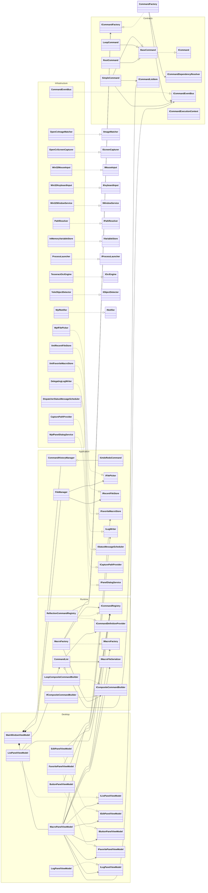

# AutoTool クラス図

```mermaid
classDiagram
direction LR

namespace Desktop {
  class MainWindowViewModel
  class MacroPanelViewModel
  class ListPanelViewModel
  class EditPanelViewModel
  class ButtonPanelViewModel
  class FavoritePanelViewModel
  class LogPanelViewModel
  class IListPanelViewModel
  class IEditPanelViewModel
  class IButtonPanelViewModel
  class IFavoritePanelViewModel
  class ILogPanelViewModel
}

namespace Application {
  class FileManager
  class CommandHistoryManager
  class IUndoRedoCommand
  class IFilePicker
  class IRecentFileStore
  class IFavoriteMacroStore
  class ILogWriter
  class IStatusMessageScheduler
  class ICapturePathProvider
  class IPanelDialogService
}

namespace Runtime {
  class CommandList
  class ICommandRegistry
  class ICommandDefinitionProvider
  class ReflectionCommandRegistry
  class IMacroFactory
  class MacroFactory
  class IMacroFileSerializer
  class ICompositeCommandBuilder
  class IfCompositeCommandBuilder
  class LoopCompositeCommandBuilder
}

namespace Contracts {
  class ICommand
  class BaseCommand
  class RootCommand
  class LoopCommand
  class SimpleCommand
  class ICommandFactory
  class ICommandDependencyResolver
  class ICommandEventBus
  class ICommandListItem
  class ICommandExecutionContext
}

namespace Infrastructure {
  class CommandEventBus
  class OpenCvImageMatcher
  class OpenCvScreenCapturer
  class Win32MouseInput
  class Win32KeyboardInput
  class Win32WindowService
  class PathResolver
  class InMemoryVariableStore
  class ProcessLauncher
  class TesseractOcrEngine
  class YoloObjectDetector
  class WpfFilePicker
  class XmlRecentFileStore
  class XmlFavoriteMacroStore
  class DelegatingLogWriter
  class DispatcherStatusMessageScheduler
  class CapturePathProvider
  class WpfPanelDialogService
  class WpfNotifier
}

MainWindowViewModel *-- MacroPanelViewModel
MainWindowViewModel *-- CommandHistoryManager
MainWindowViewModel *-- FileManager

MacroPanelViewModel --> IMacroFactory
MacroPanelViewModel --> IMacroFileSerializer
MacroPanelViewModel --> ICommandRegistry
MacroPanelViewModel --> ICommandEventBus
MacroPanelViewModel --> ILogWriter
MacroPanelViewModel --> IListPanelViewModel
MacroPanelViewModel --> IEditPanelViewModel
MacroPanelViewModel --> IButtonPanelViewModel
MacroPanelViewModel --> ILogPanelViewModel
MacroPanelViewModel --> IFavoritePanelViewModel

ListPanelViewModel ..|> IListPanelViewModel
EditPanelViewModel ..|> IEditPanelViewModel
ButtonPanelViewModel ..|> IButtonPanelViewModel
FavoritePanelViewModel ..|> IFavoritePanelViewModel
LogPanelViewModel ..|> ILogPanelViewModel

ListPanelViewModel --> CommandList
ListPanelViewModel --> ICommandRegistry
EditPanelViewModel --> ICommandRegistry
ButtonPanelViewModel --> ICommandRegistry
FavoritePanelViewModel --> IFavoriteMacroStore

FileManager --> IFilePicker
FileManager --> IRecentFileStore
CommandHistoryManager o-- IUndoRedoCommand

CommandList --> ICommandDefinitionProvider
CommandList --> IMacroFileSerializer
CommandList o-- ICommandListItem

ReflectionCommandRegistry ..|> ICommandRegistry
ReflectionCommandRegistry ..|> ICommandDefinitionProvider
ReflectionCommandRegistry --> ICommandFactory

MacroFactory ..|> IMacroFactory
MacroFactory --> ICommandRegistry
MacroFactory --> ICommandFactory
MacroFactory --> ICompositeCommandBuilder
IfCompositeCommandBuilder ..|> ICompositeCommandBuilder
LoopCompositeCommandBuilder ..|> ICompositeCommandBuilder

BaseCommand ..|> ICommand
RootCommand --|> BaseCommand
LoopCommand --|> BaseCommand
SimpleCommand --|> BaseCommand
SimpleCommand --> ICommandListItem
SimpleCommand --> ICommandEventBus

ICommandFactory <|.. CommandFactory
CommandFactory --> ICommandDependencyResolver
CommandFactory --> ICommandEventBus

CommandEventBus ..|> ICommandEventBus
OpenCvImageMatcher ..|> IImageMatcher
OpenCvScreenCapturer ..|> IScreenCapturer
Win32MouseInput ..|> IMouseInput
Win32KeyboardInput ..|> IKeyboardInput
Win32WindowService ..|> IWindowService
PathResolver ..|> IPathResolver
InMemoryVariableStore ..|> IVariableStore
ProcessLauncher ..|> IProcessLauncher
TesseractOcrEngine ..|> IOcrEngine
YoloObjectDetector ..|> IObjectDetector
WpfFilePicker ..|> IFilePicker
XmlRecentFileStore ..|> IRecentFileStore
XmlFavoriteMacroStore ..|> IFavoriteMacroStore
DelegatingLogWriter ..|> ILogWriter
DispatcherStatusMessageScheduler ..|> IStatusMessageScheduler
CapturePathProvider ..|> ICapturePathProvider
WpfPanelDialogService ..|> IPanelDialogService
WpfNotifier ..|> INotifier
```